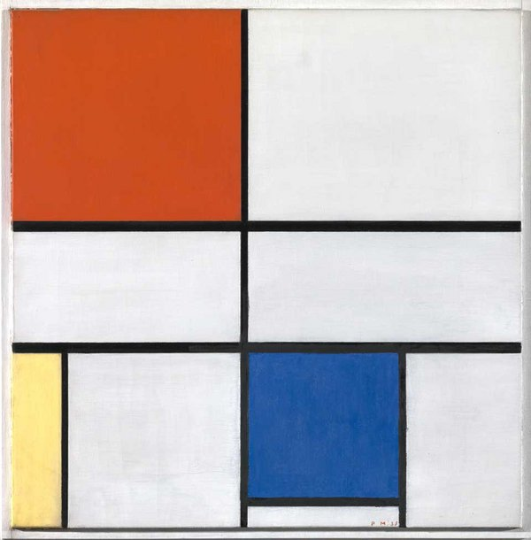

# Project Portfolio

A collection of projects that I have worked on

## Description

The Layout was inspired by a the famous Mondrian paintings that have influenced art, architecture and graphic design. By choosing this concept, I am acknowledging my career as an Architect and my future as Software Developer

### Piet Mondrian - Composition C, 1935 (Tate)

Initial [Mondrian Portfolio Concept](https://mondrian-portfolio-concept.netlify.app/) tested with GatsbyJS, and Tailwind CSS

## What this app does?

- Introduces myself with links to my CV
- Shows projects that I've worked on, what technologies I've used, with links to the code on Github, as well as a live version of the app / website
- Provides my contact information and a Contact Form

## Credits:

- Contact Form supported by [Netlify](https://www.netlify.com/)
- Icons by [Font Awesome](https://fontawesome.com/)
- Photography by the Author
